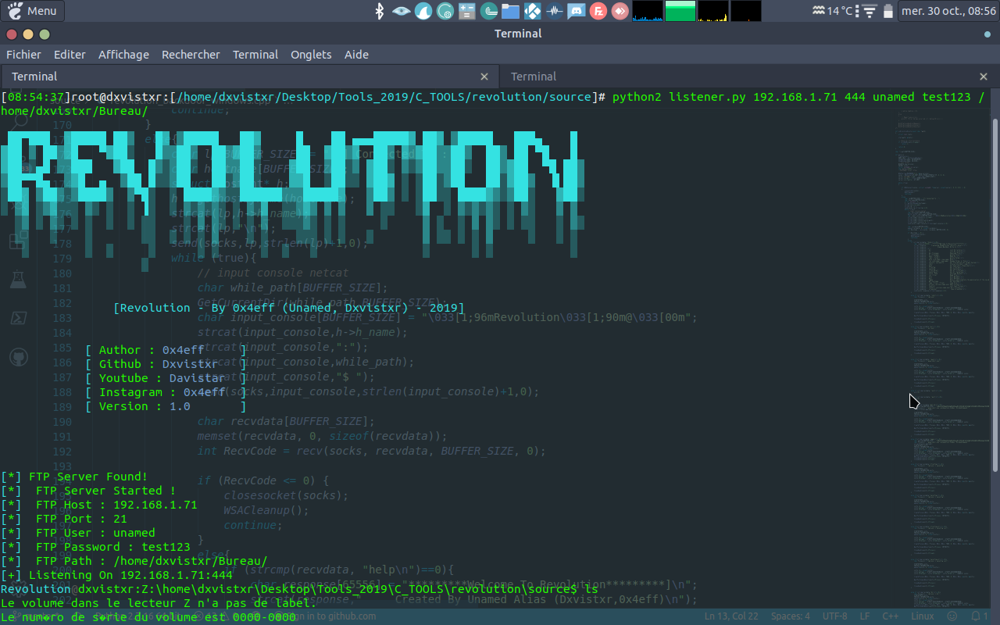
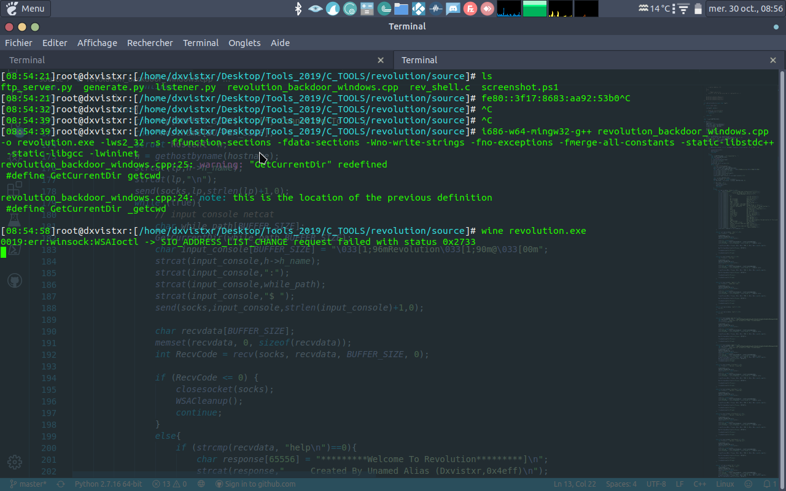

# RevolutionShell
Backdoor For Windows Target Write in C/CPP and Listener in Python

## requirements:
    apt install mingw-w64-x86-64-dev

## for compile backdoor :
     i686-w64-mingw32-g++ revolution_backdoor_windows.cpp -o revolution.exe -lws2_32 -s -ffunction-sections -fdata-sections -Wno-write-strings -fno-exceptions -fmerge-all-constants -static-libstdc++ -static-libgcc -lwininet

## for listen :
    python2 listener.py <host> <port> <ftpuser> <ftppassword> <ftppath>
  

